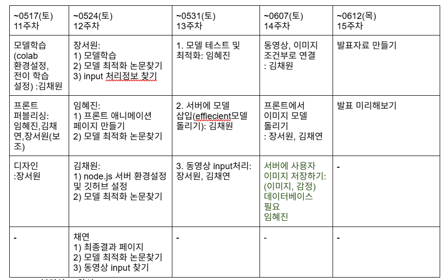

# 📝 회의록 - 2025년 4월 14일 (7주차)

## 참석자(참여도)
- 장서원(100%), 김채원(100%), 임혜진(100%), 김채연(100%)

## 회의 내용 요약
진행상황 공유

## 다음 주 할 일
-동영상 input 처리 방법 조사하고, 논의하기

## 회의 내용 
## 1. 진행 상황

- 김채원
  - Colab 환경 설정
  - Node.js 서버 환경 설정 및 GitHub 설정
- 임혜진
  - 프론트 퍼블리싱 (일부 완료)
  - 모델 테스트 및 최적화
- 장서원
  - 웹 페이지 디자인 완성
- 김채연
  - 프론트 퍼블리싱 보조

## 2. 예정 일정 및 역할 분담

---

## 3. 12주차 상세 진행 상황

### ✅ 프론트엔드

- 이미지 업로드 페이지 퍼블리싱 완료
- 애니메이션 로딩 페이지: 임혜진
- 최종결과 페이지: 김채연

### ✅ 모델 관련

- 모델 작성: 장서원
- 모델 최적화 전략 분석: 5/18 회의 예정
- 모델 테스트 및 최적화: 임혜진

### ✅ 서버

- Node.js 서버 환경설정 완료: 김채원
- Node.js 코드 구현 진행 중: 김채원
- 동영상 input 처리: 장서원, 김채연
