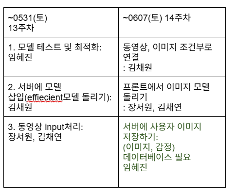

# 📝 회의록 - 2025년 4월 14일 (7주차)

## 참석자(참여도)
- 장서원(100%), 김채원(100%), 임혜진(100%), 김채연(100%)

## 회의 내용 요약
진행상황 공유

## 다음 주 할 일
-동영상 input 처리 방법 조사하고, 논의하기

## 회의 내용 
## 1. 진행 상황
오늘 회의 주제: 과적합 완화를 위해 사용할 수 있는 방법에 대해 논의하고, 그 코드에 대한 파트 분배

1. 과적합 완화방법

1) Dropout 비율 증가 (난이도 1)
2) 데이터 증강 (난이도 3)
3) EarlyStopping & ReduceLROnPlateau 콜백 추가
//학습이 과도하게 되지 않도록 조기 종료와 학습률 조절을 추가
from tensorflow.keras.callbacks import EarlyStopping, ReduceLROnPlateau

early_stop = EarlyStopping(monitor='val_loss', patience=3, restore_best_weights=True)
reduce_lr = ReduceLROnPlateau(monitor='val_loss', patience=2, factor=0.5, min_lr=1e-6)

model.fit(
    train_gen,
    validation_data=val_gen,
    epochs=30,
    callbacks=[early_stop, reduce_lr]
)

4)  Base 모델 중 일부만 Fine-tune
지금은 base_model.trainable = True로 전체를 학습시키고 있는데, 일부 층만 푸는 것이 더 안정적입니다.

fine_tune_at = 100  # 전체 레이어 중 뒤에서 100개만 학습
for layer in base_model.layers[:fine_tune_at]:
    layer.trainable = False

5) L2 정규화 추가 (Dense 레이어에)
Dense 레이어에 L2 정규화를 추가하면 가중치가 너무 커지는 걸 방지할 수 있습니다

from tensorflow.keras.regularizers import l2

outputs = Dense(len(class_names), activation='softmax',
                kernel_regularizer=l2(0.001))(x)

2. 진행상황 체크 및 파트분배

1) 프론트 퍼블리싱
-이미지 업로드 페이지 -> 퍼블리싱 완료
-애니메이션 로딩페이지 -> 임혜진 :월요일까지

https://codepen.io/davidkpiano/pen/ZpRXGj
마우스로 공을 움직일 수 있고, 공을 따라 시선과 고개가 움직이게 js를 작성해주세요! :월요일까지

-최종결과 페이지 -> 임혜진
병합 작업만 남음 -> 혜진 navigate : 목요일까지

https://colab.research.google.com/drive/1T_NWOdyZ5qdcaHP2xCpeKc5uYxdgykh9?usp=sharing#scrollTo=p9ZG3SeclLhp

https://drive.google.com/drive/u/0/folders/1-9JnevorOMu-NfkiV_OIePj0skYKQod5

2) 최적화작업
-Dropout 비율 증가 &  EarlyStopping & ReduceLROnPlateau 콜백 추가 : 장서원 월요일
-데이터증강 : 김채연 화요일~목요일
-Base 모델 중 일부만 Fine-tune :    김채원 금요일~토요일
지금은 base_model.trainable = True로 전체를 학습시키고 있는데, 일부 층만 푸는 것이 더 안정적입니다.

fine_tune_at = 100  # 전체 레이어 중 뒤에서 100개만 학습
for layer in base_model.layers[:fine_tune_at]:
    layer.trainable = False

-L2 정규화 추가 (Dense 레이어에) : 김채원
Dense 레이어에 L2 정규화를 추가하면 가중치가 너무 커지는 걸 방지할 수 있습니다

from tensorflow.keras.regularizers import l2

outputs = Dense(len(class_names), activation='softmax',
                kernel_regularizer=l2(0.001))(x)

3) input처리(동영상->이미지) 초기작업:장서원 토요일까지

채원 -> yolov5 조사하라고 하신거 해왔습니다 코랩 적용법: [Object Detection] 누구나 쉽게 따라할 수 있는 YOLOv5 모델 학습하기 | 커스텀 데이터 | YOLOv5 예제 코드 - https://mvje.tistory.com/111
이게 객체 인식하는거! 저번에 말한 공모전하면서 했다는거영
엉엉
근데 이미지처리보단 객체 인식이 강하긴해 강아지, 고양이 이렇게분류해주는느낌?  넹

