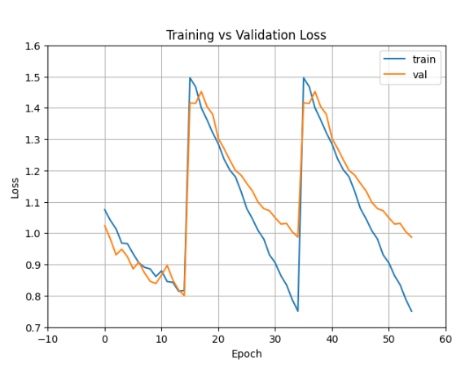

# 📝 회의록 - 2025년 4월 14일 (7주차)

## 참석자(참여도)
- 장서원(100%), 김채원(100%), 임혜진(100%), 김채연(100%)

## 회의 내용 요약
진행상황 공유

## 다음 주 할 일

 
## 회의 목표
1) 사진 넣었을 때 잡는 에러 잡기

2) 정확도 70%로 올림
B4  + L2 + 데이터 증강 + 이미지크기 112*112

## 회의 내용
 개선하거나 확인할 수 있는 점
사용 중인 optimizer 및 learning rate scheduler 설정 확인해보세요. (torch.optim.lr_scheduler.CosineAnnealingWarmRestarts 가능성 높음)

그래프에서 각 주기마다 best epoch을 기록하여, 이후에는 early stopping을 활용해 과적합 방지도 고려할 수 있습니다.
-epoch 수
-이미지 사이즈

3) 캡스톤 디자인 참여할지  오케이~~~
https://ctl.sungshin.ac.kr/ko/learning/notice/view/155

1) 장서원 : aws 환경 설정  + 이미지 사이즈 늘리기 + 이미지 업로드 api 작성
2) 김채원 : 모델 업그레이드 + 모델 삽입 api 
3) 김채연 : 계정 바꿔서 모델 테스트 + 모델 삽입(cursor ai) api
업로드된 이미지로 모델의 판단결과 반환 api

-이미지업로드 api
-모델삽입해서 결과 돌려주는 api 

4) 임혜진 : 프론트 완료 + 오류 수정 (cursor ai)

다음주 회의 금요일 10시
채원이의 새로운 시도
적용한 것 

목요일 모델 업그레이드 방법 메일
금요일 서버 완료 -> 프론트연동
